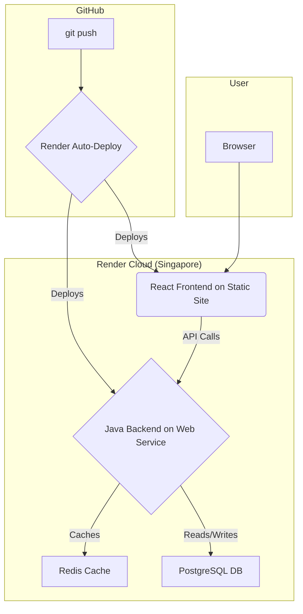

# QuickLink: A Full-Stack URL Shortening Service

A **production-grade, full-stack application** providing a comprehensive URL shortening service. Engineered for **scalability** and **high performance**, this platform is built with a modern, decoupled architecture featuring a **React frontend** and a robust, containerized **Java Spring Boot backend API**. The entire system is deployed on **Render** with a fully automated CI/CD pipeline.

---

## 🚀 Live Demo

You can use the live application here:  
**[QuickLink Live Demo](https://url-shortener-frontend-fmej.onrender.com)**

> **Note:** Free tier services on Render may "spin down" after a period of inactivity, so the first load might be slightly slow.


> *(Action: Replace this with a new, updated screenshot of your beautiful application!)*

---

## ✨ Key Features

- **Interactive & Responsive Frontend**  
  A clean, user-friendly interface built with React that allows for seamless bulk URL shortening and a dynamic results display.

- **High-Throughput Batch Processing**  
  A powerful API endpoint (`/api/v1/shorten-batch`) capable of shortening hundreds of URLs in a single request, with a detailed `207 Multi-Status` response that reports the status of each individual URL.

- **High-Performance Caching**  
  Leverages Redis to cache frequently accessed URLs, drastically reducing database load and ensuring near-instantaneous redirection for popular links.

- **Automated Cloud Deployment**  
  Zero-touch CI/CD pipeline. Any git push to the main branch automatically triggers a build and deployment of the appropriate service (frontend or backend) on Render with zero downtime.

---

## 🏗️ Architecture & Technology Stack

The system is designed as a **decoupled multi-service architecture**, with a distinct separation between the frontend, backend, database, and cache.



---

### Category | Technologies

| Category            | Technologies                                                                                   |
|---------------------|-----------------------------------------------------------------------------------------------|
| **Frontend**        | React.js, JavaScript (ES6+), HTML5, CSS3, Axios                                               |
| **Backend**         | Java 17, Spring Boot 3, Spring Data JPA, Spring Web, Spring Cache                             |
| **Database & Cache**| PostgreSQL (persistent storage), Redis (caching)                                              |
| **DevOps & Cloud**  | Docker, Docker Compose, Nginx, Render (PaaS), CI/CD                                           |
| **API & Tools**     | REST, Postman, VS Code, Git & GitHub, Yarn                                                    |

---

## ⚙️ Local Development

To run this project on your local machine, you will need **Docker Desktop** installed.

**Clone the repository:**
```bash
git clone https://github.com/Prashanthpcr/url-shortener-platform.git
cd url-shortener-platform
```

**Run the entire stack:**  
The `docker-compose.yml` file will build the frontend and backend images and run them alongside the database and cache.
```bash
docker-compose up --build
```

**Access the application:**
- Frontend will be available at [http://localhost:3000](http://localhost:3000).
- Backend API will be available at [http://localhost:8080](http://localhost:8080).

---

## ✍️ Author

**Prashanth Reddy**  
GitHub: [@Prashanthpcr](https://github.com/Prashanthpcr)  
LinkedIn: [linkedin.com/in/prashanthpcr-100428187](https://www.linkedin.com/in/prashanthpcr-100428187/)  

---
